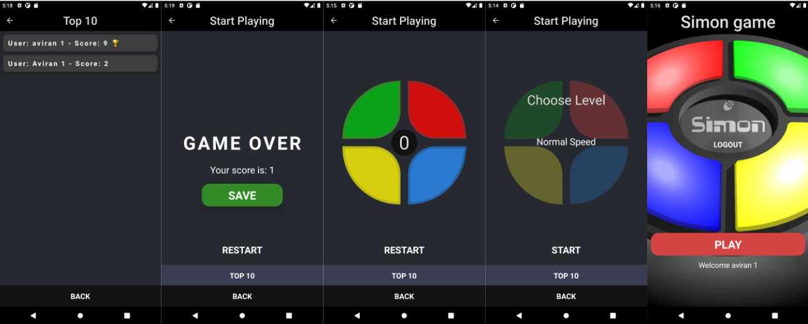

# Simon Game Mobile Application

## Introduction

This is a full-stack API application for mobile with react native of the simon memory game.
I Built this app in order to provide the full stack server and client with a casual mobile game.
This app contains top 10 page with the best member's scores of the game.
This app contains four changeable difficulty levels of game speed.

## Built with

- React native
- Redux
- Node.js
- Express.js
- MongoDB
- Android Sudio SDK

## Getting Started

Prerequisites:
Setting up the development environment

- Node.js
- Java SE Development Kit (JDK)

Setup:
npm i/yarn && npm/yarn run android for the client react native
npm i/yarn && npm/yarn run for the server side node.js
